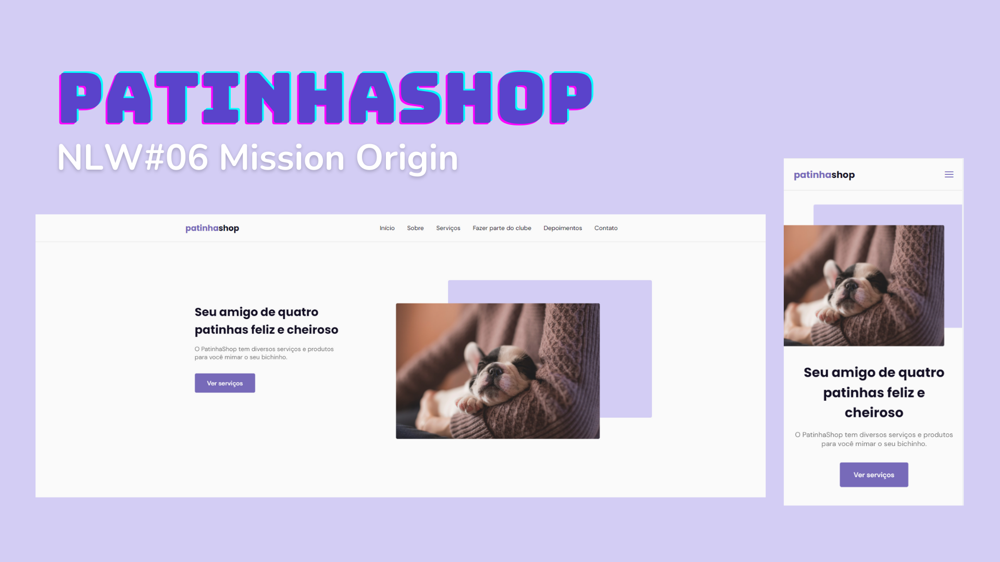

# 🐾 PatinhaShop 🐾

  

## 💻 Projeto

O PatinhaShop é uma página institucional de um petshop fictício. O projeto possui o formato de uma One Page responsiva, portanto é possível acessá-lo de diversos dispositivos e foi desenvolvido durante a NLW 06 na Mission Origin oferecida pela Rocketseat 🚀💜.

## 🚀 Tecnologias

Esse projeto foi desenvolvido com as seguintes tecnologias:

- HTML
- CSS
- JavaScript

**Bibliotecas**

- [Google Fonts](https://fonts.google.com/)
- [SwipeJS](https://github.com/nolimits4web/Swiper)
- [ScrollRevel](https://scrollrevealjs.org)

**Utilitários**

- [randomuser.me](https://randomuser.me/photos)
- [IconMoon](https://icomoon.io/app/#/select)

## 📝 Licença

Esse projeto está sob a licença MIT. Veja o arquivo [LICENSE](.github/LICENSE.md) para mais detalhes.

---
